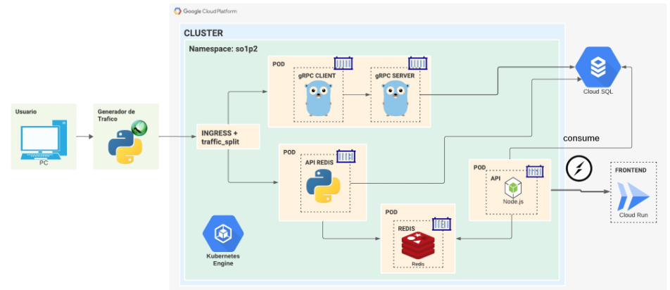
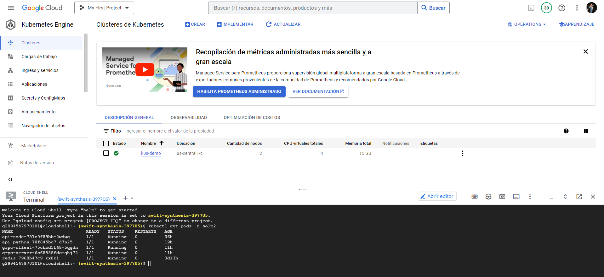
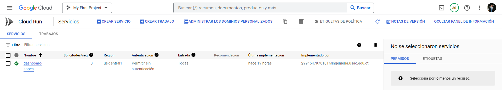
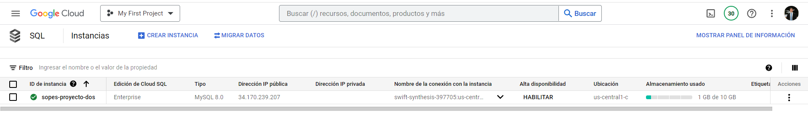
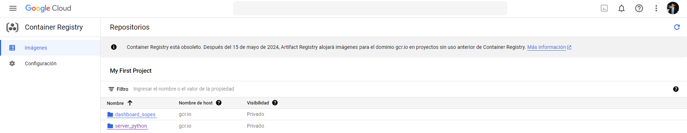
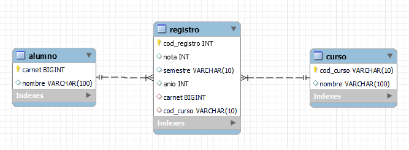
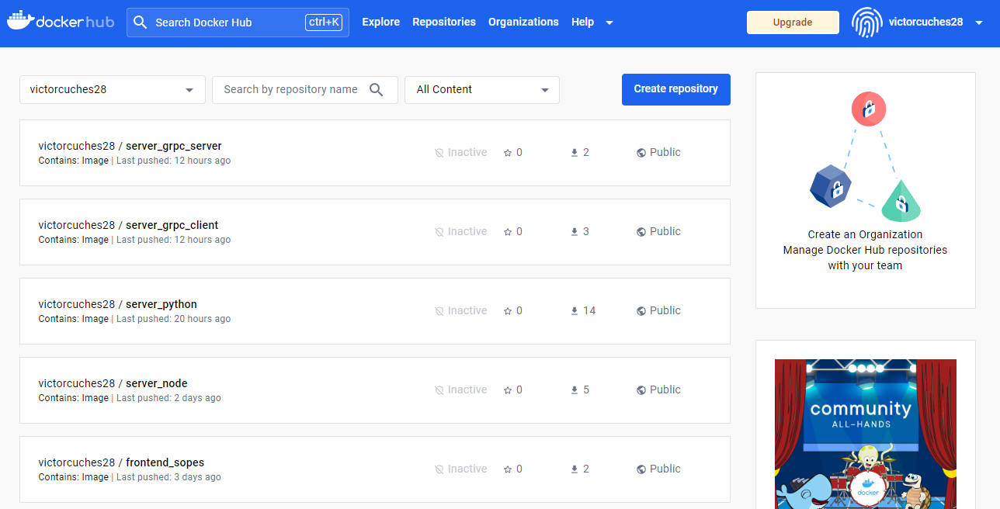

# Manual Tecnico Proyecto 2 - SOPES 1


Universidad San Carlos de Guatemala <br>
Facultad de Ingeniería <br>
Escuela de Ciencias y Sistemas <br>
Sistemas Operativos 1<br>
Ing. Jesús Alberto Guzmán Polanco <br>
Aux. Daniel  <br>


| Nombre | Carnet |
|--|--|
| Victor Alejandro Cuches de León | 201807307  |


---
### Objetivos

- Desplegar un clúster de Kubernetes y sus servicios.
- Conocer ServerLess por medio de Cloud Run.
- Utilizar bases de datos en la nube con Cloud SQL y Redis.
- Controlar el tráfico de datos por medio de balanceadores de carga.


--- 
# Arquitectura


--- 
# Servicios de Google Cloud Platform

## Clusteres de Kubernetes


## Cloud Run


## SQL


## Container Registry



# Diagrama Entidad - Relacion


- Stored Procedure: registro_estudiante

# Docker Hub


# Especificaciones tecnicas 
## Api Python
Se realizo una api en Python utilizando el framework Flask, esta api tenia una interaccion con Redis ingresando los registros para luego visualizarlos en tiempo real y tambien con la base de datos en MySQL registrando los datos para visualizarlos en el historial de la aplicacion.

## Pod Redis
Se desplego un pod de Redis en el cluster el puerto para conectarse a este contenedor es el 6379.

## Pod Api Node 
Esta api realizada con Node utilizando Express se utilizan sockets para obtener los registros en tiempo real del pod Redis y asi transmitirlos al front con un 1 segundo de espera. Tambien tiene una conexion con MySQL para obtener los registros en el historial y asi mismo realizar los diferentes reportes que podemos visualizar en el historial.

## grpc-client y grpc-server
La api grpc-client realizada con fiber recibe los datos de entrada de la peticion y se los transmite a grpc-server esta se encarga de registrar los datos en la base de datos MySQL.

# Formato de datos de entrada 
``` json
{
    "carnet": 233233,
    "nombre": "Alumno 1",
    "curso": "SO1",
    "nota": 90,
    "semestre": "2S",
    "year": 2023
}
```

