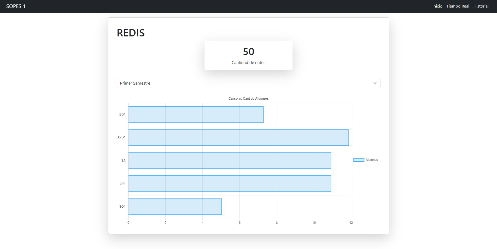
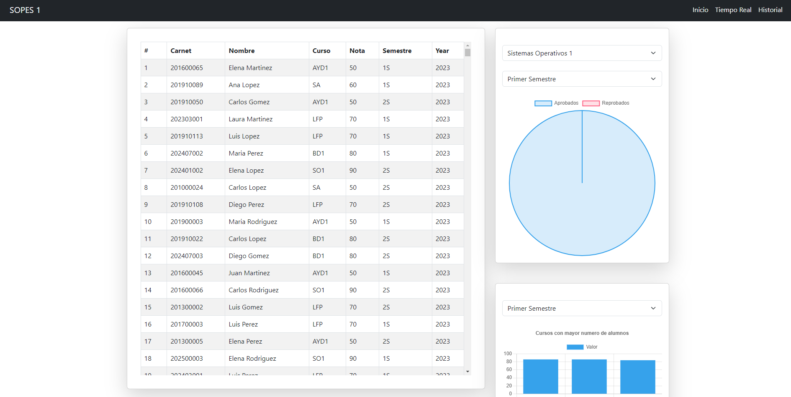

# Manual Tecnico Proyecto 2 - SOPES 1


Universidad San Carlos de Guatemala <br>
Facultad de Ingeniería <br>
Escuela de Ciencias y Sistemas <br>
Sistemas Operativos 1<br>
Ing. Jesús Alberto Guzmán Polanco <br>
Aux. Daniel  <br>


| Nombre | Carnet |
|--|--|
| Victor Alejandro Cuches de León | 201807307  |


---
### Objetivos

- Desplegar un clúster de Kubernetes y sus servicios.
- Conocer ServerLess por medio de Cloud Run.
- Utilizar bases de datos en la nube con Cloud SQL y Redis.
- Controlar el tráfico de datos por medio de balanceadores de carga.

# Cloud Run
Ingresar al siguiente link donde se encuentra desplegada la aplicacion:

https://dashboard-sopes-naxbpim4sq-uc.a.run.app/

# Uso de Locust 
## Path Python-Node
``` python
class MessageTraffic(HttpUser):
    wait_time = between(0.1, 0.9)
    reader = Reader()
    reader.load()

    def on_start(self):
        print(">> MessageTraffic: Inicio de envío de tráfico")

    @task
    def PostMessage(self):
        random_data = self.reader.pickRandom()

        if ( random_data is not None ):
            data_to_send = json.dumps(random_data)
            printDebug(data_to_send)
            self.client.post("", json=random_data) #quitar / para apy python
        else:
            print(">> MessageTraffic: Envío finalizado")
            self.stop(True)

    @task
    def GetMessage(self):
        self.client.get("/")
```

Codigo utilizado para enviar el trafico de peticiones a la api de python. Ejecutar el siguiente comando: 
```
locust -f traffic.py
```

### Dashboard
Visualizaciones en tiempo real 



Visualizaciones del historial de registros 



## Path grpc
``` python
class MessageTraffic(HttpUser):
    wait_time = between(0.1, 0.9)
    reader = Reader()
    reader.load()

    def on_start(self):
        print(">> MessageTraffic: Inicio de envío de tráfico")

    @task
    def PostMessage(self):
        random_data = self.reader.pickRandom()

        if ( random_data is not None ):
            data_to_send = json.dumps(random_data)
            printDebug(data_to_send)
            self.client.post("/", json=random_data) #quitar / para apy python
        else:
            print(">> MessageTraffic: Envío finalizado")
            self.stop(True)

    @task
    def GetMessage(self):
        self.client.get("/")
```

Codigo utilizado para enviar el trafico de peticiones a la api de python. Ejecutar el siguiente comando: 
```
locust -f traffic.py
```

### Dashboard

Visualizaciones del historial de registros 


# Despliegue en Google Cloud
Para que funcione correctamente la aplicacion es importante tener los deployment y servicios desplegados para esto usar estos comandos

```
kubectl apply -f deployRedis.yaml
kubectl apply -f deployPython.yaml
kubectl apply -f deployNode.yaml
kubectl apply -f deployGrpc.yaml
```


Asimismo tenes disponibles las imagenes de docker 


