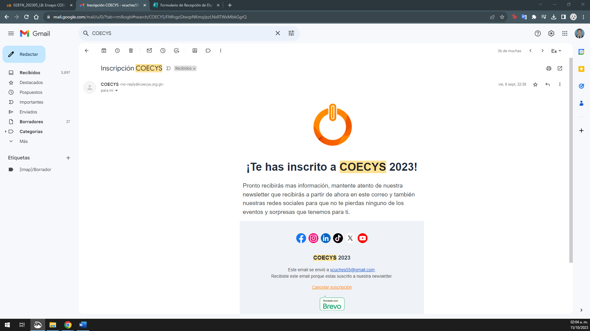

# Infraestructura como Código con Terraform
## Christian Marlon Renato Fabián Natareno
## Jueves, 28 de septiembre de 2023

Actualmente, se trata de automatizar la mayoría de las actividades que realizamos día a día esto con el fin de que nos lleve el menos tiempo posible y ese tiempo poder emplearlo en otras cosas. En lo personal no conocía que en la creación de la infraestructura fuera posible automatizarla, pensaba que al crear por ejemplo un Bucket S3 en AWS teníamos que hacerlo manualmente paso a paso y lo consideraba bastante tedioso estar haciendo las cosas una por una, por esta razón me lleve una buena sorpresa con esta conferencia en la que aprendí funcionalidades novedosas. 

La infraestructura como código con Terraform es como un conjunto de instrucciones escritas en un lenguaje de programación que le dice a una computadora cómo debe construir y configurar toda la infraestructura tecnológica de una empresa, como servidores, bases de datos, redes y más. En lugar de hacerlo manualmente, como se hacía antes, ahora podemos escribir código que describe qué recursos necesitamos y cómo deben estar configurados. Luego, Terraform se encarga de hacer realidad esas instrucciones, creando y gestionando automáticamente los recursos de manera consistente y eficiente.
Terraform no solo acelera la implementación de la infraestructura, sino que también mejora su calidad y facilita la adaptación a las necesidades cambiantes del negocio, lo que lo convierte en una herramienta esencial en el mundo de la tecnología actual. Entre los beneficios que nos proporciona Terraform puedo mencionar: automatización, escalabilidad, consistencia, portabilidad y colaboración.
En conclusión, Terraform hace que la gestión de la infraestructura sea más rápida, confiable y escalable, al permitirnos definirla como código y automatizar su implementación y mantenimiento. Esto es especialmente útil en entornos de nube y grandes sistemas donde la escalabilidad y la consistencia son fundamentales.

Comentario personal 
Me pareció interesante la conferencia, es un tema que me llamo mucho la atención y estaré indagando poco a poco. El conferencista menciono que Terraform también tiene relación con DevOps asimismo realizo un ejemplo con un pipeline, es bastante completo todo lo que podemos hacer con Terraform y los beneficios que podemos obtener de implementarlo. Se relaciona el tema de la conferencia con el contenido del curso y laboratorio, es un tema que enriquece y ayuda a desarrollar lo visto en este semestre.

### Conclusiones
- Permite implementar recursos de manera rápida y confiable, lo que es crucial en proyectos de desarrollo y operaciones. Esta automatización puede liberarte de tareas tediosas y permitirte concentrarte en actividades de mayor valor.
- Garantiza la consistencia en la configuración de la infraestructura, lo que reduce los problemas relacionados con la falta de uniformidad en la configuración de recursos. Esto es especialmente importante en entornos laborales, donde la consistencia puede tener un impacto significativo en la seguridad y el rendimiento.
- Terraform es una herramienta esencial en el mundo tecnológico actual y está relacionada con prácticas como DevOps. Al aprender Terraform, como estudiante estoy adquiriendo habilidades relevantes y demandadas en la industria.

### Asistencia conferencia

