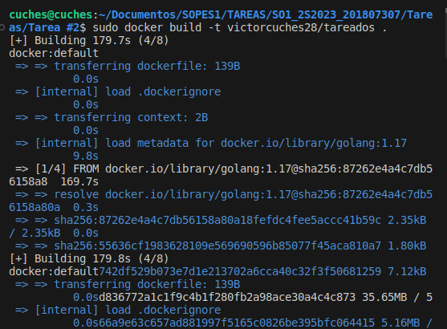
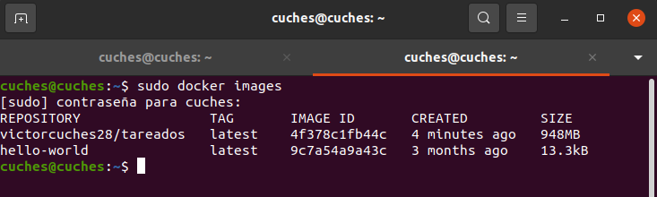
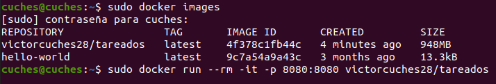
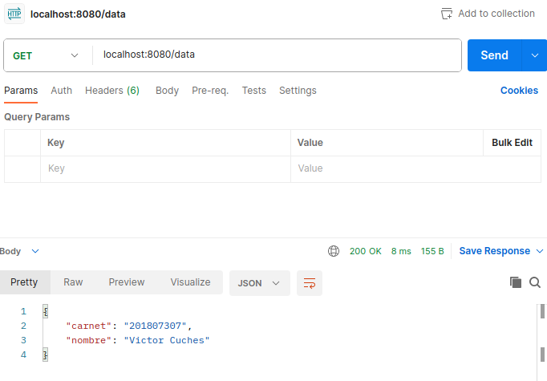

# TAREA #2
Victor Alejandro Cuches de Leon 201807307

## Captura de los comandos utilizados para crear la imagen y comando para correrlo

## Captura de imagen creada, por medio de docker images

## Captura del contenedor corriendo, por medio de docker ps

## Captura de postman

