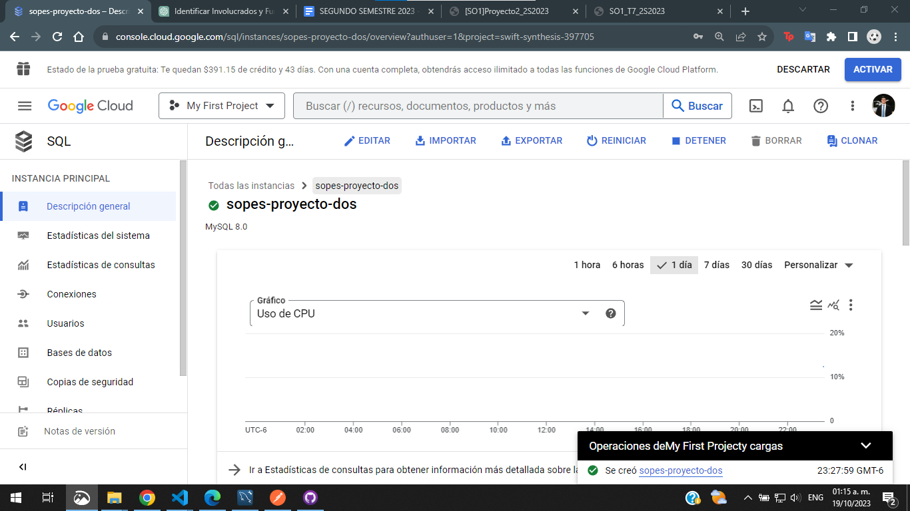

Link de grabacion:
# TAREA #7
[Link de grabacion](https://drive.google.com/file/d/1GVWCPgkD2SDU1KCgUtJT4V6E3ybUO5q4/view?usp=sharing)

El codigo se encuentre en la siguiente carpeta 
[Proyecto 2](https://github.com/VictorCuches/SO1_2S2023_201807307/tree/main/Proyecto2)

## Captura de MySQL en GCP
